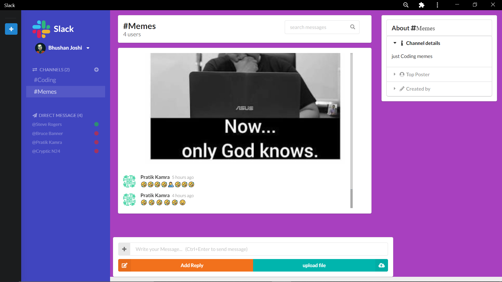
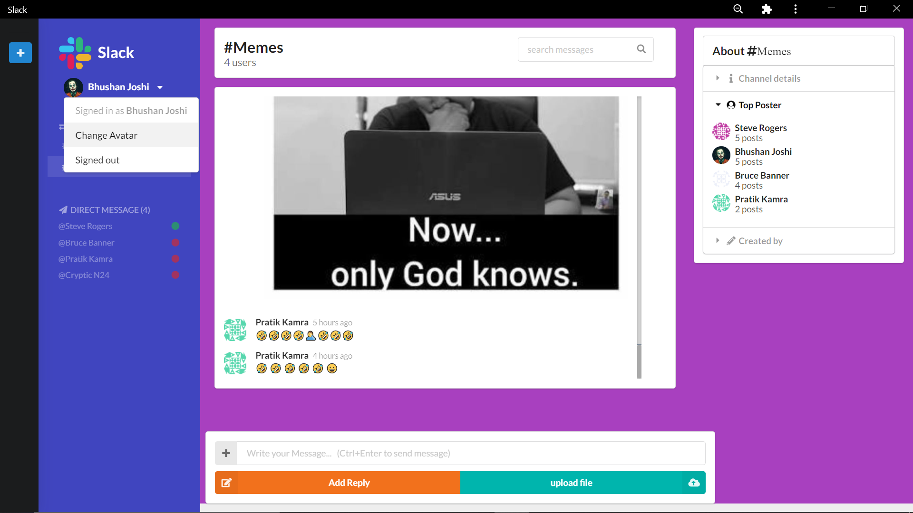
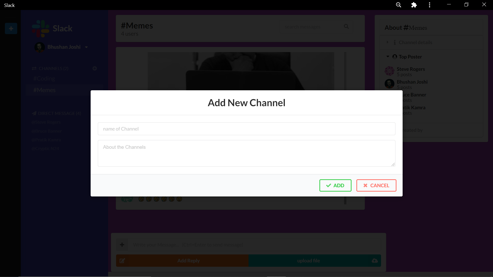
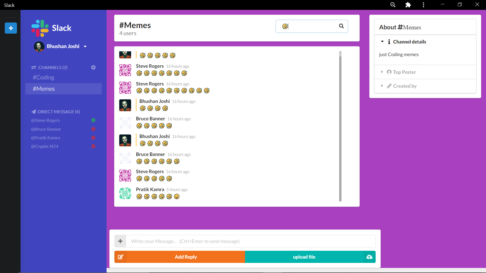
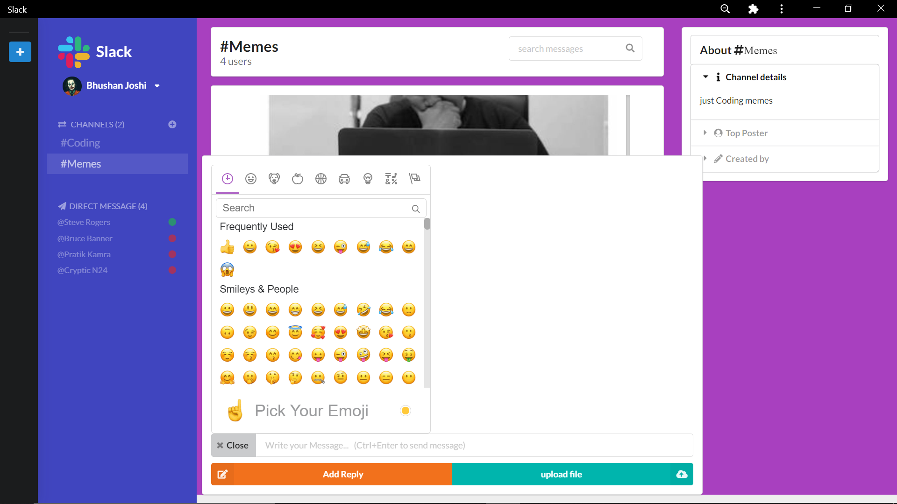

# Simple [Slack Clone](https://slackclone-dc1c7.web.app) PWA(Progressive Web Apps)

This is a Simple Slack like progressive web app using [React](https://reactjs.org/) and [Firebase](https://firebase.google.com/)

---

## To start setting up the project

Step 1: Clone the repo:

```bash
git clone https://github.com/Bhushan-joshi/Slack_Clone.git
```

Step 2: cd into the cloned repo and run:

```bash
npm i
```
Step 3: create src/firebase.js file and  Put your firebase credentials in it:

```javascript
import firebase from 'firebase/app';
import "firebase/auth";
import "firebase/database";
import "firebase/storage";

const firebaseConfig = {
    apiKey: "API_KEY",
    authDomain: "PROJECT_ID.firebaseapp.com",
    databaseURL: "https://PROJECT_ID.firebaseio.com",
    projectId: "PROJECT_ID",
    storageBucket: "PROJECT_ID.appspot.com",
    messagingSenderId: "SENDER_ID",
    appId: "APP_ID",
    measurementId: "G-MEASUREMENT_ID",
};
firebase.initializeApp(firebaseConfig);

export default firebase;
```

Step 4: spinup your server and hit [localhost](http://127.0.0.1:3000) by:
```bash
npm start
```
> Tech stack:
   * [React](https://reactjs.org/)
   * [Firebase](https://firebase.google.com/)
   * [React Router](https://reactrouter.com/)
   * [Redux](https://redux.js.org/)
   * [React-Redux](https://react-redux.js.org/)
   * [semantic-ui-react](https://react.semantic-ui.com/)
   * [emoji-mart](https://github.com/missive/emoji-mart)
---
## Here are some Images







---

## Contribute

You can fork this repo and send me a PR.
